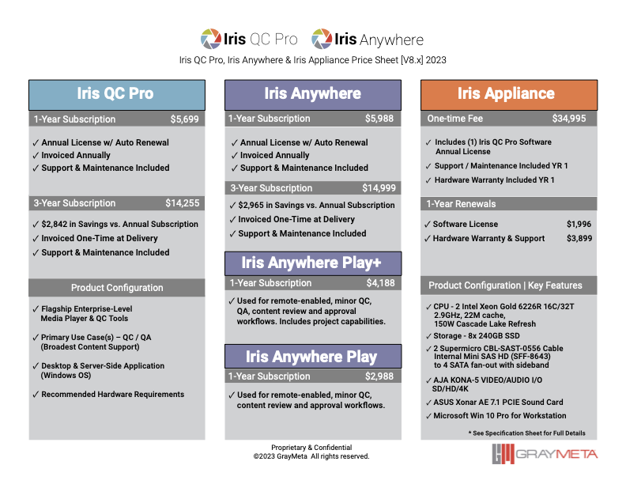

# Deploying GrayMeta Iris Anywhere with Terraform
The following contains instructions/criteria for deploying Iris Anywhere into an AWS environment.  Iris Anywhere is comprised of two key components, the Iris Admin Server that manages Users, permissions and Licenses and the Iris Anywhere Autoscaling Group that deploy the instances for usage. Iris Anywhere Autoscaling Group will not properly function without a dedicated Iris Admin Server deployed first. 

### Iris Anywhere and AWS
* Iris Anywhere requires AWS core services which are supported in all AWS Regions
  
### Prerequisites
* AWS account access
* EC2 Windows Server 2022
* Registered domain name (optional)
* Stored credentials in [Secrets Manager](#creating-secrets-for-iris-anywhere) prior to deploying.
* Access to GrayMeta Iris Admin and Iris Anywhere AMI's - Contact support@graymeta.com.
* Iris Anywhere license provided by Graymeta - Contact support@graymeta.com.
* Certificates created or imported in AWS Certificate Manager.
* Terraform 12, 13 & 14 compatible.
* `version` - Current version is `v0.0.27`. Note moddule version requires Iris Anywhere AMI access.
* No AWS Root user security context should be used in the deployment of any/all Iris Anywhere services.  Please follow the policy of least privilege for all access granted as part of the deployment. 
***

### Sizing of Infrastructure
* Iris Anywhere provides multiple configurable options relating to infrastructure sizing, such as instance types, disk size, and autoscaling group size.  Each customer will have unique needs which will determine their sizing configuration.  Graymeta will work with the customer to determine the best sizing plan.

### Deployment Duration
New customers can expect and initial deployment duration of 3-4 hours.  There are multiple components, some of which are optional, to an Iris Anywhere deployment.  The duration may vary based on specific customer needs and/or unique customer environments.

### Specialized Knowledge
* Infrastruction As Code (IAC)
  * Terraform - specifically versions 0.12, 0.13, or 0.14
* Powershell scripting knowledge is beneficial
* AWS Services familiarity with...
  * IAM (Free Service)
    * Create necessary profile(s)
    * Create keys
    * Policy creation
  * Route53 (Billable Service)
  * EC2 (Billable Service)
    * Specific compute needs  
  * RDS (Billable Service)
  * OpenSearch/ElasticSearch (Billable Service)
  * S3 (Billable Service)
  * ACM (Free Service)
  * VPC/Networking (Free Service with optional Billable VPC services)
  * NAT Gateway (Billable Service)
  * SQS (optional) (Billable Service)


### Publicly Accessible Services
* In most cases, ONLY the ALB or the HAProxy Load Balancer are publicly accessible resources.

### Data Security
* EC2 key/pair creation is utilized for the secure Iris Admin and Iris Anywhere instance access.  This key_name will be utilized in the terraform modules mentioned below.
* Access/Secret Access Key - Will be created as part of the terraform execution to allow Iris Anywhere access to the S3 media content.
* AWS Secrets Manager holds sensitive configuration data for Iris Anywhere. This data contains encrypted key values.
* S3 contains encrypted media content that is pulled to an instance where the content is again encrypted on the block storage (EBS).
* As the media content is streamed to the Iris Anywhere player, it is AES encrypted. 
* The networking is configured by utilizing the Graymeta irisanywhere version best suited for the customer needs. All networking components will be created for when running the Graymeta terraform below.


***
## Iris Anywhere Admin Server
Deploys Iris Admin management server. This application provides comprehensive administrative capabilities, API and development support.  An Iris Admin Server must be deployed, licensed and configured prior to the deployment of the Autoscaling Groups as there are dependent variables ascertained during the process.  

The below example will allow the customer to deploy the Iris Admin Server. After the deployment is complete navigate to the instance's https://{IPv4 DNS}:8021 to log in to the Iris Admin Server.  Once successfully logged in, contact support@graymeta.com to license the product as well as retrieve the necessary variables to deploy the Iris Anywhere Autoscaling Groups.

## Resulting AWS Services and Architecture Diagram


## Example Usage

```
provider "aws" {
  region  = "us-west-2"
  profile = "my-aws-profile"
}

module "irisadmin" {
  source = "github.com/graymeta/terraform-aws-irisanywhere//admin?ref=v0.0.27"
    
  access_cidr     = ["0.0.0.0/0"]
  hostname_prefix = "iadm"
  instance_count  = 1
  instance_type   = "t3.xlarge"
  subnet_id       = ["subnet-foo1"]
  key_name        = "my_key"
  ia_secret_arn   = "arn:aws:secretsmanager:secret:1234567913397769129"
  associate_public_ip = true
}
```
### Argument Reference:
* `access_cidr` - (Optional) List of network cidr that have access.  Default to `["0.0.0.0/0"]`
* `hostname_prefix` - (Required) A unique name.
* `instance_count` - (Required) Number of Instances to deploy.
* `instance_type` - (Required) The type of the EC2 instance.
* `subnet_id` - (Required) A list of subnet IDs to launch resources in.
* `key_name` - (Required) The key name to use for the instances.
* `ia_secret_arn` - (Required) ARN of secrets for configurating Iris Anywhere.
* `tags` -  (Optional) A map of the additional tags.
* `volume_type` - (Optional) EBS volume type. Default to `gp3`.
* `volume_size` - (Optional) EBS volume size. Default to `60`.

### Attributes Reference:
In addition to all the arguments above the following attributes are exported:
* `security_group` - The Security Group of the Admin instance(s).
* `private_dns` - The Private IPv4 DNS of the Admin instance(s).
* `private_ip` - The Private IPv4 address of the Admin instance(s).

***
## Iris Anywhere Autoscaling Groups
Deploys Application Load Balancer and Autoscaling group.  Graymeta recommends the customer does not deploy Autoscaling Groups until the Iris Admin Server has been licensed with GrayMeta (support@graymeta.com).

## Example Usage
```
provider "aws" {
  region  = "us-west-2"
  profile = "my-aws-profile"
}

locals {
  # Calculates scale in/out threshold based on session count.
  ia_max_sessions        = 3
  asg_scaleout_threshold = local.ia_max_sessions - 1
  asg_scalein_threshold = local.ia_max_sessions + 1
}

module "irisanywhere1" {
  source = "github.com/graymeta/terraform-aws-irisanywhere//asg?ref=v0.0.27"
  access_cidr = ["0.0.0.0/0"]
  alb_internal = false
  lb_check_interval       = 30
  lb_unhealthy_threshold  = 2
  asg_check_interval      = 60
  asg_scalein_cooldown    = 420
  asg_scalein_evaluation  = 2
  asg_scalein_threshold   = local.asg_scalein_threshold
  asg_scaleout_cooldown   = 420
  asg_scaleout_evaluation = 2
  asg_scaleout_threshold  = local.asg_scaleout_threshold
  asg_size_desired        = 1
  asg_size_max            = 3
  asg_size_min            = 1
  disk_data_iops          = 3000
  disk_data_size          = 700
  disk_data_type          = "io2"
  disk_os_size            = 300
  disk_os_type            = "gp2"
  hostname_prefix         = "iris1"
  instance_type           = "c5n.9xlarge"
  key_name                = "my_key"

  ssl_certificate_arn     = "<cert_arn>"
  subnet_id               = ["subnet-foo1", "subnet-foo2"]

  tags                    = {
    "my_tag1" = "my_value1",
    "my_tag2" = "my_value2"
  }

  # Entries for IrisAnywhere
  ia_max_sessions          = local.ia_max_sessions
  ia_secret_arn            = "arn:aws:secretsmanager:secret:1234567913397769129"
  s3_policy                = file("custom_policy.json")
  iam_policy_enabled       = true
  search_enabled           = true
}
  
```

### Argument Reference:
The following arguments are supported:
* `access_cidr` - (Optional) List of network cidr that have access.  Default to `["0.0.0.0/0"]`
* `alb_internal` - (Optional) sets the application load balancer for Iris Anywhere to internal mode.  When set to `true` this also disables allocating public IP addresses to Iris Anywhere EC2 instances. Default to `false`
* `asg_check_interval` - (Optional) Autoscale check interval.  Default to `60` (seconds)
* `asg_scalein_cooldown` - (Optional) Scale in cooldown period.  Default to `300` (seconds)
* `asg_scalein_evaluation` - (Optional) Scale in evaluation periods.  Default to `2` (evaluation periods)
* `asg_scalein_threshold` - (Optional) Scale in if the number of sessions drop below.  Default to `5`
* `asg_scaleout_cooldown` - (Optional) Scale out cooldown period.  Default to `300` (seconds)
* `asg_scaleout_evaluation` - (Optional) Scale out evaluation periods. Default to `2` (evaluation periods)
* `asg_scaleout_threshold` - (Optional) Scale out if the number of sessions drop below.  Default to `5`
* `asg_size_desired` - (Required) The number of EC2 instances that should be running in the group.
* `asg_size_max` - (Required) Maximum size of the Auto Scaling Group.
* `asg_size_min` - (Required) Minimum size of the Auto Scaling Group.
* `asg_warm_pool_min` - (Optional) Minimum size of the Auto Scaling Group Warm Pool. Default is 0.
* `asg_warm_pool_max` - (Optional) Maximum size of the Auto Scaling Group Warm Pool. Default is 0.
* `base_ami` - (Optional) The AMI from which to launch the instance.  Default to latest released AMI
* `disk_data_iops` - (Optional) The amount of provisioned IOPS. This must be set with a volume_type of io1/io2.
* `disk_data_size` - (Optional) EBS volume size.  Default to `300`
* `disk_data_type` - (Optional) EBS volume type.  Default to `io2`
* `disk_os_size` - (Optional) EBS volume size.  Default to `50`
* `disk_os_type` - (Optional) EBS volume type.  Default to `gp3`
* `hostname_prefix` - (Required) A unique name.
* `iam_policy_enabled` - (Optional) Enables the ability to add custom IAM policies for the instance profile
* `instance_type` - (Required) The type of the EC2 instance.
* `key_name` - (Required) The key name to use for the instances.
* `lb_algorithm_type` - (Optional) Determines how the load balancer selects targets when routing requests.  The value is round_robin or least_outstanding_requests.  Default to `round_robin`
* `lb_check_interval` - (Optional) Loadbalancer health check interval. Default to `30` (seconds)
* `lb_unhealthy_threshold` - (Optional) Loadbalancer unhealthy threshold.  Default to `2` (evaluation periods)
* `s3_policy` - (Optional) Provides customers the ability to supply their own IAM policy for instance profile to access S3 buckets - file("custom_policy.json")
* `ssl_certificate_arn` - (Required) The ARN from ACM of the SSL server certificate for Load Balancer.
* `subnet_id` - (Required) A list of subnet IDs to launch resources in.
* `tags` - (Optional) A map of the additional tags.

* `ia_cert_crt_arn` - (Optional) ARN from AWS Secrets. This enables end to end SSL on Iris Anywhere application server. Blank will force non-SSL between LB and Server.  Default to blank
* `ia_cert_key_arn` - (Optional) ARN from AWS Secrets. This enables end to end SSL on Iris Anywhere application server. Blank will force non-SSL between LB and Server.  Default to blank
* `ia_domain` - (Required) domain name of SSL wildcard SSL used for end to end SSL, ie "yourdomain.com", or "test.yourdomain.com". Domain must match cert SAN.
* `ia_secret_arn` - (Required) ARN of secrets for configurating Iris Anywhere.
* `ia_max_sessions` - (Required) Set max sessions per Iris Anywhere instance before autoscaling.
* `iam_role_name` - (Optional) Set name for IAM Role.
* `search_enabled` - (Optional) Enable use of Elastic Search for s3 indexing.
* `s3_sse_cmk_enabled` - (Optional) Enables S3 SSE CMK for customers with managed keys.
* `s3_sse_cmk_arn` - (Optional) ARN of Customer Managed KMS Key.
* `ia_video_bitrate` - (Optional) Sets video bitrate for Iris Anywhere. Default is 10000.
* `ia_video_codec` - (Optional) Sets video codec for Iris Anywhere streams. Default is VP9.
* `asg_warm_pool_min` - (Optional) Warm pool minimum value. Default is 0
* `asg_warm_pool_max` "(Optional) Warm pool maximum value
* `update_asg_lt` - (Optional) Updates launch template to latest. Default is true
* `s3_progressive_retrieval` = (Optional) Sets the s3 download retrieval option for Iris Anywhere.  Default to `True`
* `s3_reclaim_maxused` = (Optional) Sets the Max used scratch space available threshold before data is offlined.  Default to `90` 
* `s3_reclaim_minused` = (Optional) Sets the Minimum used scratch space available threshold before data is offlined.  Default to `80` 
* `s3_reclaim_age` (Optional) Sets the age of files threshold for data stored before data is offlined.  Default to `8h`
* `s3_enterprise` (Optional) "Uses Config Map for S3 buckets configured with SSE - Contact GrayMeta for key/value info"

### Attributes Reference:
In addition to all the arguments above the following attributes are exported:
* `alb_dns_name` - The DNS name of the load balancer.
* `asg_name` - The autoscaling group name
* `nsg_alb_id` - Network Security Group for ALB
* `nsg_iris_id` - Network Security Group for ASG instances

### Optional Additional Resources

Set your own scaling schedule. For example, if you expect more usage during business hours Monday - Friday, you can plan your scaling actions accordingly.

Example: Add a resource block like this to your `main.tf`.

```
resource "aws_autoscaling_schedule" "iris1_schedule_start" {
  scheduled_action_name  = "iris1-schedule-start"
  recurrence             = "0 16 * * MON-FRI"
  desired_capacity       = 2
  max_size               = 10
  min_size               = 2
  autoscaling_group_name = module.iris1.asg_name
}

resource "aws_autoscaling_schedule" "iris_anywhere_9xl_schedule_end" {
  scheduled_action_name  = "iris1-schedule-end"
  recurrence             = "0 6 * * MON-FRI"
  desired_capacity       = 0
  max_size               = 10
  min_size               = 0
  autoscaling_group_name = module.iris1.asg_name
}
```

`recurrence` - (Optional) The time when recurring future actions will start. Start time is specified by the user following the Unix cron syntax format.   Based on UTC/GMT.

`desired_capacity`, `max_size`, `min_size` - (Optional) Default `0`. Set to `-1` if you don't want to change the value at the scheduled time.

### Creating Secrets for Iris Anywhere
Before deploying Iris Admin and Iris Anywhere (ASG), the customer will need to create a secret in AWS Secrets Manager with the following keys/values:

Required by Iris Admin server (these inputs are specified by the customer)
* Key : Value
* `admin_db_id`        : userid for Iris Admin database
* `admin_db_pw`        : password for Iris Admin database
* `admin_console_id`   : userid of Iris Admin console
* `admin_console_pw`   : password for Iris Admin console

Required by Iris Anywhere ASG:
* Key : Value
* `admin_customer_id`  : provided by GrayMeta licensing
* `admin_server`       : DNS of Iris Admin server
* `iris_s3_bucketname` : Name of S3 bucket you would like to attach to Iris Anywhere
* `iris_s3_access_key` : IAM Access Key with permission to access bucket
* `iris_s3_secret_key` : IAM Secret key associated with access key
* `iris_s3_lic_code`   : S3 connector license code - provided by GrayMeta during licensing
* `iris_s3_lic_id`     : S3 connector license id - provided by GrayMeta during licensing
* `iris_serviceacct`   : account used to run Iris Anywhere

Secrets required for End to End SSL (optional).  Create two seperate secret credentials:
* `Certificate in X509 DER format` in plain text.
* `Certificate Private Key` in plain text.

### Creating DNS for the Iris ASG load balancer
Create a DNS record for the Iris Anywhere implementation. A CNAME pointing to the load balancer.

### AWS Quotas & Service Limits
Select an AWS service to view its service limits.
* [IAM](https://docs.aws.amazon.com/IAM/latest/UserGuide/reference_iam-quotas.html)
* [Route 53](https://docs.aws.amazon.com/Route53/latest/DeveloperGuide/DNSLimitations.html)
* [EC2](https://docs.aws.amazon.com/AWSEC2/latest/UserGuide/ec2-resource-limits.html)
* [RDS](https://docs.aws.amazon.com/AmazonRDS/latest/UserGuide/CHAP_Limits.html)
* [OpenSearch/ElasticSearch](https://docs.aws.amazon.com/opensearch-service/latest/developerguide/limits.html)
* [S3](https://docs.aws.amazon.com/AmazonS3/latest/userguide/BucketRestrictions.html)
* [ACM](https://docs.aws.amazon.com/acm/latest/userguide/acm-limits.html)
* [VPC](https://docs.aws.amazon.com/vpc/latest/userguide/amazon-vpc-limits.html)
* [NAT Gateway](https://docs.aws.amazon.com/vpc/latest/userguide/vpc-nat-gateway.html)
* [SQS](https://docs.aws.amazon.com/AWSSimpleQueueService/latest/SQSDeveloperGuide/sqs-quotas.html)

### Emergency Maintenance
The Iris Anywhere platform has been designed to be highly reproducible.  If ever a fault condition was found, whether it be hardware or software, the IA platform could easily be destroyed and fully recovered from the backup snapshots.  Prior to taking action, please contact support@graymeta.com for a full analysis.

### Graymeta Service-Level Agreement
Each customer has different requirements based on multiple sets of criteria.  Graymeta will be provide a unique SLA that best suits the customers business requirements.

### Cost Structure

