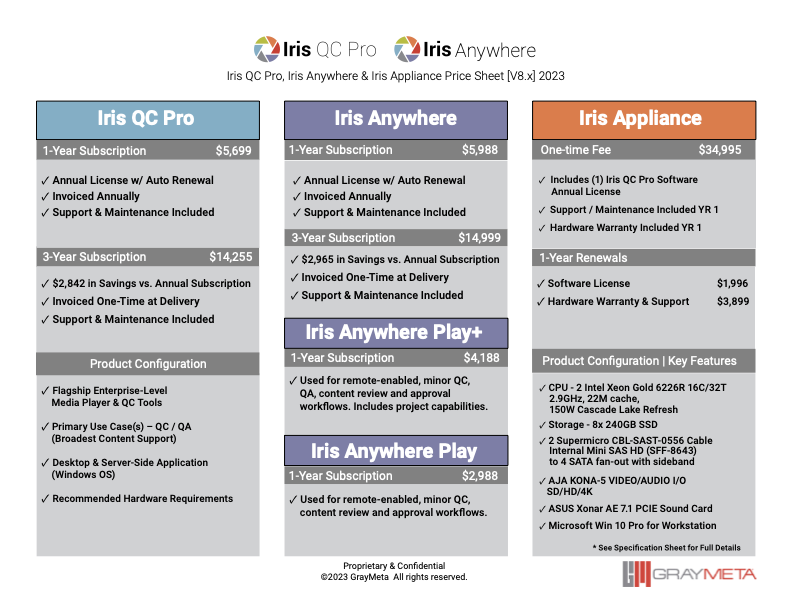

# Deploying GrayMeta Iris Anywhere with Terraform

This repository contains Terraform modules used to deploy GrayMeta Iris Admin and Iris Anywhere into AWS. Iris Admin manages users, permissions, and licensing. Iris Anywhere deploys the autoscaled application tier. In normal deployments, Iris Admin should be deployed, licensed, and configured before Iris Anywhere.

## Prerequisites

* AWS account access with least-privilege permissions for the services you plan to deploy.
* Terraform 1.8.x or compatible.
* Certificates imported into AWS Certificate Manager when using TLS termination on a load balancer.
* Required application secrets stored in AWS Secrets Manager before deployment.
* Access to the GrayMeta Iris Admin and Iris Anywhere AMIs. Contact support@graymeta.com.
* An Iris license from GrayMeta. Contact support@graymeta.com.

## Modules

* `admin` deploys Iris Admin, either standalone or with enterprise HA.
* `asg` deploys the Iris Anywhere application tier, including the ALB-based path and the optional HAProxy-based path.
* `secrets` creates the required Secrets Manager payloads.
* `es` provisions the search domain used by Iris Anywhere; `opensearch` contains helper workflows related to search integration.
* `sqs` supports optional queue-based integrations.

## Choosing a Deployment Pattern

Use this decision matrix to choose the closest starting point before you begin changing variables.

| Need | Recommended pattern | Why | Starter example |
| --- | --- | --- | --- |
| One Admin node with simple public access | Standalone Admin | Lowest operational overhead, fastest initial deployment | [examples/admin-standalone/main.tf](examples/admin-standalone/main.tf) |
| Admin tier with load balancer and RDS | HA Admin | Use when you need Admin redundancy and managed database backing | [examples/admin-ha/main.tf](examples/admin-ha/main.tf) |
| Iris Anywhere behind an AWS ALB | Anywhere with ALB | Best default when AWS-native load balancing is acceptable | [examples/anywhere-alb/main.tf](examples/anywhere-alb/main.tf) |
| Iris Anywhere behind HAProxy | Anywhere with HAProxy | Use when HAProxy-specific TLS or traffic handling is required | [examples/anywhere-haproxy/main.tf](examples/anywhere-haproxy/main.tf) |

Quick guidance:

* Choose ALB unless you specifically need HAProxy behavior.
* Choose standalone Admin for smaller or initial deployments.
* Choose HA Admin when Admin uptime and managed database HA are requirements.
* Add the `es` module only when Iris Anywhere search is enabled.

## Example Root Modules

Starter customer root modules are available under [examples/README.md](examples/README.md). These examples are intentionally small and opinionated so customers can start from a pattern instead of assembling module calls from scratch.

Note: IAM resources are account-scoped. If you deploy the same shared IAM role or policy names from multiple regional root modules, manage their lifecycle from a single state or use region-specific names to avoid cross-region destroy conflicts.

## Deployment Order

Use this sequence for a typical customer deployment:

1. Create the required Secrets Manager entries, either with the `secrets` module or manually.
2. Deploy `admin` and complete product licensing and basic validation.
3. Deploy `es` only if search is required for the environment.
4. Update the application secret with any search-specific values if `es` was deployed.
5. Deploy `asg` for the Iris Anywhere application tier.
6. Create DNS records after the infrastructure apply succeeds.

Quick rule of thumb:

* `admin` comes before `asg` in normal deployments.
* `es` is optional and only needed when search is enabled.
* `secrets` is optional as Terraform, but the secret values themselves must exist before `admin` or `asg` can be configured successfully.

## Resulting AWS Services and Architecture Diagram


## Iris Admin Example

```hcl
provider "aws" {
  region  = "us-west-2"
  profile = "my-aws-profile"
}

module "irisadmin" {
  source = "github.com/graymeta/terraform-aws-irisanywhere//admin?ref=<tag>"

  hostname_prefix     = "iadm"
  instance_type       = "t3.xlarge"
  subnet_id           = ["subnet-foo1"]
  key_name            = "my-key"
  ia_secret_arn       = "arn:aws:secretsmanager:us-west-2:123456789012:secret:iris-admin"
  associate_public_ip = true
}
```

Common inputs:

* `hostname_prefix`
* `instance_type`
* `subnet_id`
* `key_name`
* `ia_secret_arn`
* `associate_public_ip`
* `enterprise_ha`

See [admin/README.MD](admin/README.MD) for the full Admin input and output reference.

## Iris Anywhere Example

```hcl
provider "aws" {
  region  = "us-west-2"
  profile = "my-aws-profile"
}

module "irisanywhere1" {
  source = "github.com/graymeta/terraform-aws-irisanywhere//asg?ref=<tag>"

  hostname_prefix = "iris"
  instance_type   = "c7a.4xlarge"
  key_name        = "my-key"
  subnet_id       = ["subnet-1", "subnet-2"]
  ia_secret_arn   = "arn:aws:secretsmanager:us-west-2:123456789012:secret:iris-anywhere"
  ssl_alb_acm_arn = "arn:aws:acm:us-west-2:123456789012:certificate/xxxxxxxx-xxxx-xxxx-xxxx-xxxxxxxxxxxx"

  warm_pool              = { enabled = true }
  asg_size_min           = 0
  asg_size_max           = 1
  asg_size_desired       = 1
  asg_scalein_threshold  = 1
  asg_scaleout_threshold = 0
}
```

Common inputs:

* `hostname_prefix`
* `instance_type`
* `key_name`
* `subnet_id`
* `ia_secret_arn`
* `ssl_alb_acm_arn` when using the ALB path.
* `haproxy` and the HAProxy-specific variables when using HAProxy instead of the ALB path.

See [asg/README.MD](asg/README.MD) for the full ASG input and output reference.

## Creating Secrets for Iris Anywhere

Before deploying Iris Admin and Iris Anywhere, create a secret in AWS Secrets Manager with the application values required by your deployment.

Required by Iris Admin:

* `admin_db_id`
* `admin_db_pw`
* `admin_console_id`
* `admin_console_pw`

Common Iris Anywhere secret values:

* `admin_customer_id`
* `admin_server`
* `s3_enterprise`

Storage-related values are deployment-dependent and are not always required:

* `iris_s3_bucketname`
* `iris_s3_access_key`
* `iris_s3_secret_key`

Optional secrets are also used for end-to-end TLS, SAML, search, and storage integrations. The exact payload depends on which optional features and storage path you enable.

## DNS

Create a DNS record for the Iris Anywhere endpoint after deployment. For the ALB path, this is typically a CNAME pointing to the load balancer DNS name.

## Service Limits

Review relevant AWS quotas before deployment:

* [IAM](https://docs.aws.amazon.com/IAM/latest/UserGuide/reference_iam-quotas.html)
* [Route 53](https://docs.aws.amazon.com/Route53/latest/DeveloperGuide/DNSLimitations.html)
* [EC2](https://docs.aws.amazon.com/AWSEC2/latest/UserGuide/ec2-resource-limits.html)
* [RDS](https://docs.aws.amazon.com/AmazonRDS/latest/UserGuide/CHAP_Limits.html)
* [OpenSearch](https://docs.aws.amazon.com/opensearch-service/latest/developerguide/limits.html)
* [S3](https://docs.aws.amazon.com/AmazonS3/latest/userguide/BucketRestrictions.html)
* [ACM](https://docs.aws.amazon.com/acm/latest/userguide/acm-limits.html)
* [VPC](https://docs.aws.amazon.com/vpc/latest/userguide/amazon-vpc-limits.html)
* [NAT Gateway](https://docs.aws.amazon.com/vpc/latest/userguide/vpc-nat-gateway.html)
* [SQS](https://docs.aws.amazon.com/AWSSimpleQueueService/latest/SQSDeveloperGuide/sqs-quotas.html)

## Support

Contact support@graymeta.com for AMI access, licensing, and deployment support.

## Cost Structure


